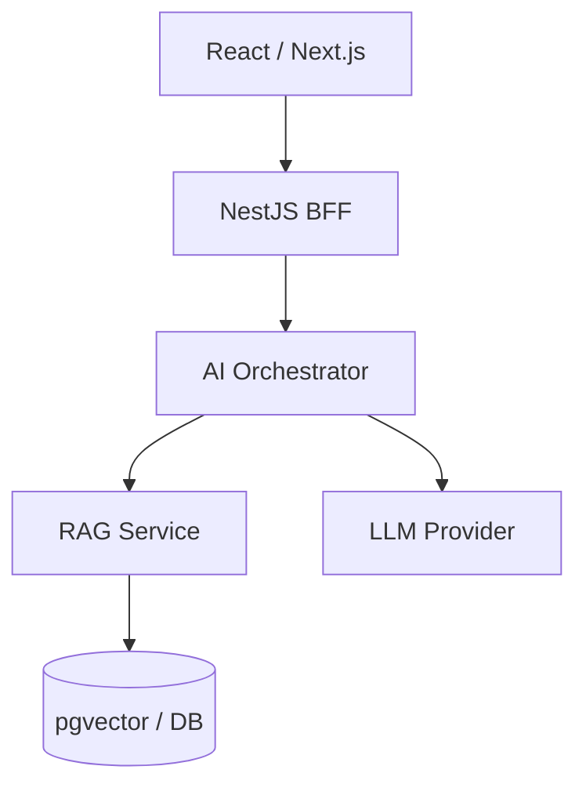

# 🤖 AI Banking Copilot

AI-powered banking copilot designed as an end-to-end product to explore how modern AI systems can be integrated into real-world applications.

This project focuses on **building, not studying**: applying LLMs, RAG, and agents within a scalable architecture aligned with real product needs.

---

## 🎯 Purpose

The goal of this project is to evolve from a traditional frontend role into an **AI Product Engineer**, by building a complete AI-driven system:

* Integrating LLMs into real product flows
* Designing scalable AI architectures
* Applying AI to business use cases (banking domain)
* Maintaining strong engineering practices

---

## 🏗️ Architecture Overview



### Layers

* **Frontend (UI):** React + TypeScript (Next.js)
* **Backend (BFF):** NestJS
* **AI Layer:**

  * LLM integration (OpenAI / Azure OpenAI)
  * RAG system
  * Agents orchestration
* **Data Layer:**

  * PostgreSQL
  * Vector DB (pgvector)
* **Infrastructure:**

  * Docker
  * CI/CD (planned)

---

## 🧠 Core Concepts

* LLM integration (prompting, streaming, orchestration)
* Retrieval-Augmented Generation (RAG)
* Embeddings & vector search
* AI agents & tools
* Prompt engineering
* Guardrails & security (prompt injection, PII)
* Observability & evaluation

---

## 📦 Project Structure (Planned)

```txt
.
├── apps/
│   ├── web/              # Frontend (Next.js)
│   └── api/              # Backend (NestJS)
│
├── packages/
│   ├── domain/           # Domain models
│   ├── application/      # Use cases
│   ├── infrastructure/   # Adapters (DB, APIs)
│   └── ai/
│       ├── agents/
│       ├── prompts/
│       ├── retrieval/
│       ├── tools/
│       └── evaluators/
│
├── docs/
│   ├── architecture/
│   ├── adr/
│   └── diagrams/
│
└── README.md
```

---

## 🧪 Development Approach

This project follows a **product-oriented and iterative approach**:

* Small, well-defined tickets
* Incremental delivery
* Real use-case driven development

Workflow:

```txt
Ticket → Branch → PR → Review → Merge
```

---

## 📌 Roadmap

* [ ] Monorepo setup (apps + packages)
* [ ] Chat UI (React)
* [ ] Backend API (NestJS)
* [ ] LLM integration
* [ ] RAG system
* [ ] Agents orchestration
* [ ] Security & guardrails
* [ ] Evaluation & metrics
* [ ] Observability
* [ ] Production-ready architecture

---

## 🔐 Security Focus

* Prompt injection protection
* Sensitive data filtering (PII)
* Controlled tool execution
* Logging & audit trails

---

## 📊 Future Improvements

* Multi-agent workflows
* Advanced evaluation pipelines
* Fine-tuning / custom models
* Real banking integrations (mocked → real APIs)
* UX improvements for AI interactions

---

## 🧭 Philosophy

> Build AI that solves real problems.

* Learn by building
* Avoid unnecessary theory
* Focus on product impact
* Combine frontend + AI + architecture

---

## 📄 License

TBD
